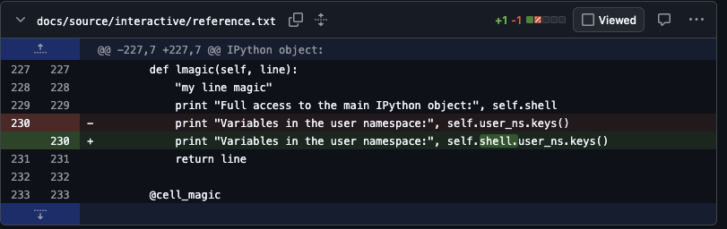

::: questions

- Should I contribute to an open source project?
- What does the process of contributing look like?
- How do I contribute to an open source project hosted on GitHub?
- What should I do if my contribution is rejected?
- Are there alternatives to contributing to an open-source project?

:::

::: objectives

- Learn how to fork an open source repository.
- Learn how to open a pull request using a branch on a forked repository.

:::

# Contributing to Open Source

In a very real sense Open Source Software is a gift from the developers: they are giving something of value with no expectation of direct return.

It is important when thinking about contributing to open source projects to keep this in mind: you are asking for their time and attention. Most people who are maintainers of open source software are really happy to have other people helping out, but for most it is an unpaid, part-time thing that they do. Some may even be willing to help new contributors come up to speed on the project. But time they spend working with you is time that they are not spending on other things, so be mindful and understanding of that.

## Why Contribute?

There are many reasons to contribute to open source software projects. Ideally it is because you use the project and want to see it become more useful to you or people that you work with: fewer bugs, more features, easier to use, and so on.  Occasionally it may be OK to contribute to a project that you don't use if there is something specific that you can bring to the table.  For example, if you are managing an open source library that makes an incompatible change you might work with downstream projects to help migrate their code. Contributing can also be a good way to learn things while solving real problems that help others.

While your primary motivations for contributing to a project should be around the goals or subject matter of the project, open source software contributions have a number of secondary benefits. For example your contributions provide a public record of your coding ability and mastery of modern software development processes, which may be useful when applying for a position. Similarly, if the codebase is related to your work, it may be something that you can give as evidence of research-related activities. Working on a project will also help your software development skills more generally—you will hone your skills on writing good code, in finding bugs, writing good tests, and so on—because your work will be being reviewed by more experienced developers who will give you feedback.

On the other hand, you shouldn't be contributing to a project that you don't use simply because it's popular or you think it will bring attention to your own work.

::: callout

## An Example Contribution

The author of this Byte-Sized course was working on integrating IPython into a GUI app, using IPython's documentation as a guide. In doing this they discovered that things weren't working quite as expected and that there was a minor error in the sample code in the documentation for custom IPython "magic" commands.

The author forked IPython and made the following one-line fix to the documentation:



and opened this [IPython pull request](https://github.com/ipython/ipython/pull/2713). It was quickly accepted. After 15 years, the [fix is still in the IPython documentation](https://github.com/ipython/ipython/blob/fdbdf1c699e80f76a71e3dc5b46a3d164939b3f2/docs/source/config/custommagics.rst?plain=1#L67), although updated for Python 3 and other changes over the years.

Writing the fix took less than half an hour, but likely saved anyone who was wanting to learn from that example much more than that.  This is the only contribution the author has made to IPython.

The take-away is that even tiny contributions have value and can have lasting impact: a small thing that makes the world a little better.

:::

## How to Contribute

You should start with an idea of what it is that you need: is it a fix for a bug, a new feature, some documentation? Whatever it is try to have it clear in your head before you start.

Most substantial open source projects have contributor guides.  They will have information about how to set up a development environment, how to run tests, the expectations for code style and quality, the mechanics of how to submit a pull request, and the review process.  You should read the contribution guide and follow its procedures. Many projects will ignore contributions which do not follow the guidelines, and may block people who repeatedly refuse to follow them.

::: callout

## AI and Open Source Contributions

At the time of writing there is some controversy in the open-source community on how to handle AI-based contributions to open-source codebases.  Some projects have enthusiastically embraced contributions generated by large language models, but many projects are facing the problem of large numbers of low-quality AI-generated pull requests.  These have to be triaged by human project maintainers: people spending effort to see if there is anything worthwhile in what they are being given; people who would much rather be writing new features or fixing bugs themselves.

Additionally there are still some unresolved legal questions about the intellectual property status of LLM generated code, and that status varies from country to country.

As a result many projects have very strict policies about AI use, including many outright bans.

Make sure that if you want to contribute to a project you follow their guidelines. And even if you are working on a project which permits LLM usage, you will likely get a better reception for your contributions if you write any issues and pull requests yourself: at the end of the day you need to convince a human that your contribution is useful and to do that you need to *engage* with them.

:::

### Example Repository

The instructor will give you a link to the code repository you will be working with.

::: instructor

Ensure you have your copy of the template repository at https://github.com/Southampton-RSG-Training/byte-sized-rse-open-source-example and give the students the URL to *your* copy of the template.

:::

Rather than a code, this repository contains information about the folk tale "Stone Soup":

``` markdown
# Stone Soup

The folk story [Stone Soup](https://en.wikipedia.org/wiki/Stone_Soup) is an
excellent allegory for the way that open source software can work.  From
Wikipedia:

> Some travelers come to a village, carrying nothing more than an empty cooking
> pot. Upon their arrival, the villagers are unwilling to share any of their
> food stores with the very hungry travelers. Then the travelers go to a stream
> and fill the pot with water, drop a large stone in it, and place it over a
> fire. One of the villagers becomes curious and asks what they are doing. The
> travelers answer that they are making "stone soup", which tastes wonderful
> and which they would be delighted to share with the villager, although it
> still needs a little bit of garnish, which they are missing, to improve the
> flavor.
> 
> The villager, who anticipates enjoying a share of the soup, does not mind
> parting with a few carrots, so these are added to the soup. Another villager
> walks by, inquiring about the pot, and the travelers again mention their
> stone soup which has not yet reached its full potential. More and more
> villagers walk by, each adding another ingredient, like potatoes, onions,
> cabbages, peas, celery, tomatoes, sweetcorn, meat (like chicken, pork and
> beef), milk, butter, salt and pepper. Finally, the stone (being inedible) is
> removed from the pot, and a delicious and nourishing pot of soup is enjoyed
> by travelers and villagers alike. Although the travelers have thus tricked
> the villagers into sharing their food with them, they have successfully
> transformed it into a tasty meal which they share with the donors.

## Recipe

Place a large pot of water over low heat and add:

- a stone

Simmer until done.  Remove stone and serve the soup.
```

Clearly, the recipe needs more ingredients.

### Open an Issue

The most basic contribution you can make is opening an issue on the project's issue tracker.  The issue could be something as simple as a minor bug, or as complex as a major new feature.  Without an issue, the maintainers may not know there is a problem.

Before opening an issue, search both the open *and* closed issues to see if there is already an open issue for what you want.  If you are lucky the issue is already resolved and may simply be waiting for a release of the software; or someone has already done the work of reporting the issue.  If you are unlucky the issue may be closed as something that won't be fixed, in which case you should carefully read the reasons and respect the decisions of the maintainers.

If there is an appropriate issue open, you may want to add additional relevant information. For example:
- for a bug, reporting that it happens on another platform, or under different circumstances, or providing more detail about the problem
- for a feature, adding your use-case or need if it is different from those already being discussed

If there isn't an open issue, you can open one, following the guidance of the contribution guide and any issue templates the project might have.  Your issue should be clearly written, describing precisely what the problem is, and what you have tried to fix it.  If you are reporting a bug you should describe your platform and environment, how you can trigger the bug, and any error messages or log files generated.  For feature requests you should describe what you are trying to do at a high level, how you would like the new feature to work, examples of usage, and *possibly* thoughts about implementation if you have sufficient knowledge.

You should monitor the issue that you have opened.  The maintainers may respond with questions to clarify what is needed and find out more information.  This may not happen immediately: maintainers may not have time to respond for days or even weeks (they may be in a different time zone from you, and even open source maintainers take vacations!).

::: challenge

Go to the GitHub repository and open an issue that suggests a way that the recipe can be improved: perhaps an ingredient to add?

:::

### Make a Pull Request

When there is an issue open to track things, you can start working on resolving it. Before you start work you should check that no-one else has started work on it (for example by assigning the issue to themselves).

Unlike your own projects, you almost certainly don't have commit rights on the project repository.  This means that before you start work you have to *fork* the repository: make your own copy of the repository where you will do you work.

::: challenge

#### Fork the Repository

On the main page of the repository, click the "Fork" button.  You should see a page which allows you to change the name of the repository. Accept the default settings.

You should now have a copy of the GitHub repository in your GitHub account.

:::

Once you have forked the repository, clone your fork to your local machine. Make a branch for your work (following any naming convention the project may have) and work on the code using your fork as you would if it were your own project.

Try to keep your changes small and self-contained and focused on the issue that you are trying to fix.  If you run into more problems as you work, open issues for them, but don't necessarily try to fix everything at once.

::: challenge

#### Clone the Repository

On the "Code" button on *your* fork of the repository, copy the SSH URL. Change directory to your root directory and then paste it into a clone command in your shell:

``` bash
cd
git clone git@github.com:[your_github_id]/byte-sized-rse-open-source-example.git
cd byte-sized-rse-open-source-example
```
:::

::: challenge

#### Create a Branch and Make Your Changes

Choose an issue that you will work on from the repository and use git to create a branch for your work.  You might want to use your name in the branch name, or some other way of making sure it doesn't conflict with the names that other people choose for their work.

``` bash
git checkout -b enhance-recipe-[your_github_id]
```

Now edit the recipe with your improvement or fixes and commit the changes.

:::

When you think that your work is ready for review push your branch to *your* fork and then in GitHub open a pull request for that branch to the project's repo (usually to the main development branch).

::: challenge

#### Push the Branch and Open a PR

Once you have made your updates, push the branch to your fork.

``` bash
git push origin enhance-recipe-[your_github_id]
```

As usual, the message gives you a GitHub URL you can open to create the pull request, or you can go to your fork on github and find the branch there to open the pull request.  However, when you start to make the PR you will see that the target for your pull request will be the upstream repository.

Fill in the description of your pull request, and then go to the upstream repository and you should see your pull request.

:::

Go through the normal code review process with the maintainers. As with opening an issue, don't expect an immediate response.

::: instructor

Pick a PR that will likely have conflicts with other PRs and merge it.

:::

If the process takes a while you may need to update your fork from the repo and merge in changes to your working branch.  The maintainers may also contribute code directly to your branch as part of the review process, in which case you will need to pull the branch from your fork to update.

::: challenge

### Resolving Merge Conflicts

After the first of the pull requests is merged, it is likely that your pull request can no longer be automatically merged.  In some projects the maintainer may manage the conflict resolution themselves, but you can also do it yourself.

Go to your fork and select the sync repository button.

In your local clone switch to the main branch and pull from your fork:
``` bash
git switch main
git pull
```

Then switch back to your branch and merge main (using a normal three-way merge, *don't* do a rebase merge), resolving any conflicts.
``` bash
git switch enhance-recipe-[your_github_id]
git merge main
```

Then push your changes back to your fork:
``` bash
git push origin enhance-recipe-[your_github_id]
```

:::

Hopefully you will end up in a place where both you and the maintainers are happy with the pull request and the maintainer will merge the PR.

### What if the Pull Request is Rejected?

This can happen for any number of reasons.  Ideally these sorts of things are resolved as part of the discussion around the issue that you opened so that you don't do a lot of work for nothing.  But it might be that the maintainer sees a different approach that might work better, or there is a fundamental flaw in your work, or that the PR is too large and needs to be broken up, or even that it makes sense to combine the PR with some other unit of work.

Or they may simply decide that, on seeing the working code, that it doesn't mesh with their idea of where they want to take the project.

At the end of the day it is their project, and they get to decide on what is included and what is not.

The good news, and the beauty of open source, is that you have a fork which contains code that *you* are happy with and which solves your problem, and so you can use your fork in the place of the main repo in your work if it makes sense.  There is some effort required to keep your fork current, and it is a little more complex to depend on your fork than the main repository, so it isn't free. But at the end of the day you have solved your problem.

## Alternatives to Contributing to a Project

Sometimes a contribution to a project is not the right way to share the work that you have done, and maintaining your own fork may be a substantial effort.  In these cases, particularly for open source libraries, it may make more sense to create an extension or "plug-in" for the open source library in your own open source project.

For example, a general-purpose machine learning library is likely to have a selection of the most general and well-proven algorithms, and won't likely accept new algorithms unless they also fall into the category.  If you have developed a new technique as part of your research, then it is unlikely that a contribution with that algorithm would be accepted.

In this case, if you were to create your own library which depends on an the general purpose library, implementing your algorithm but using its conventions, using its tools, and following its API, then your library is compatible with the general-purpose library and familiar to its users.  If you design things well, you may be able to make your algorithm a drop-in replacement for the general-purpose algorithms.

Working in this sort of way, you are more likely to get users who are familiar with the open source library you are working with to use your code. And if your algorithm gains popularity and adoption then it will be easier to integrate it into the project you are using later on.

::: keypoints

- be mindful of the constraints that face developers of open source software
- be clear to yourself on why you want to contribute to an open source project
- follow the guidelines and conventions of any project that you are planning to work with
- to make a contribution: make a fork of the project, clone it, and work on a branch, then push the branch and make a pull request
- understand that your vision and the projects visions may not agree, and that contributions may not be accepted
- consider alternatives to direct contribution to a project

:::

