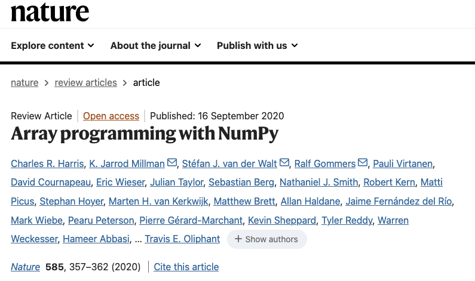

:::::::::::::::::::::::::::::::::::::: questions 

- Should I open source my code?
- 

::::::::::::::::::::::::::::::::::::::::::::::::

::::::::::::::::::::::::::::::::::::: objectives

- Understand the different types of open source licenses.

::::::::::::::::::::::::::::::::::::::::::::::::

# Releasing Open Source Code

As a researcher there are many reasons to open-source your code. In particular, if it is useful within your research community it may have a very high impact, potentially more than any paper that you write:

To successfully release open source code takes effort and perserverence, and even with that there is no guarantee that your project will catch the attention of a community or that recognition of the impact will come quickly.  The NumPy paper in Nature was published 15 years after NumPy was first released, and 25 years after Numeric, the predecsessor of NumPy, was released; and for many of the authors NumPy was a significant, unpaid and unacknowledged part of their work for years.

So if you want to open source your code, you should be very clear-headed about the reasons you are doing it, put in effort commensurate to your goals, and hope that fortune smiles on you.

## Minimal Open Sourcing

The minimum amount of effort to open source your code is to put it in a public repository on a service like GitHub and give it an appropriate license.

Your choice of license is constrained by the goals you have for your code, but also potentially by your organisation and/or funding.  Make sure that you are clear about this before you release code with a license.

This may be good enough for code associated with a paper that you are unlikely to ever re-use, but that other researchers may need access to in order to replicate your results.  But even for this minimal case, you want to follow best practices and make sure that you include instructions on how to install and use your code, as well as how to cite it.

## Open Sourcing Best Practices

However, you may wish to release open source code in a more substantial, re-usable form, either as a library or an application.  This should be an intentional decision with an understanding of the effort required and how it alings with you research and career goals.  In that case there are other things that you will likely want to do.

### Maintenance

The key thing you need to realize is the following:

| All code that is not abandoned incurs a cost just by existing.

Bugs are discovered. Dependencies change. Operating systems evolve. New platforms emerge. To keep your code current and relevant (sometimes referred to as avoiding 'bit-rot') there is a constant, low-level maintenance effort required.  The more code, the larger te effort.  You can always stop development, and that's a valid choice if the software is no longer achieving your goals, but it will get harder and harder for people to use your software as soon as you stop.  If you know you will not have the time available to do maintenance it is likely not worth the effort of anything more than a minimal open sourcing effort.

Fortunately there are things you can do to make the maintenance effort lower, many of which are already things we have discussed as best practices:

- good quality code: code which is easy to work with is easy to fix when things go wrong
- clear dependencies: to be broadly useful you will likely need to support more than a particular release of each of your dependencies, but you should be clear through whatever mechanism what your code expects the environment it runs in to look like.
- tests: if your code has good tests then it is easier to confidently make any changes needed when a dependency changes its API or you need to port it to a new platform
- automation: because maintenance is something you will only do occasionally, you want to make it easy to get a working development environment and perform any tasks that are needed (such as running tests) with a minimum of effort and fuss: you don't want to spend a day getting everything set up for a 5 minute bug-fix
- continuous integration: going along with tests and automation is the ability to run them automatically in version control, both when making changes, but more importantly for maintenance, periodically even when there are no changes. Periodic automated tests every week or month will notify you when they fail because of dependency or platform changes before it becomes an urgent issue for your project.

None of these make the maintenance effort go away, but they help manage it, and will pay-off in the long-term.

### User Documentation

Once you have working, good quality software with tests, you need to start focusing on your potential users. No one will use your code if they don't know what it does, how to install it, or how to use it.  You need user documentation.

The minimum is a "README" file, and for small packages this may be enough.  For larger packages you will want to write documentation with more depth, and for libraries you probably want to also include auto-generated API documentation as a reference.

The documentation should include a description of what the project's goals are, what it does, how to install it, what its dependencies are, and examples of how to use it.  Documentation should be under source-control, and should be able to be automatically built and deployed with minimum effort (ideally as part of CI).  Github and similar systems provide the ability to host a web site associated with a project, and aften provide tools for automatic deployment. Other options include ReadTheDocs and self-hosting.

### Building Awareness and Community

It's rare for a project to be successful without some sort of promotion: talks at conferences, posts on mailing lists, blog posts, even videos.  People won't find your project if you don't announce it.

The most obvious place to find users and potential collaborators is within your own research community, but if you are doing something of more general interest it may be worth spreading the word more widely. Conferences which are about research software development or scientific software development. For example in the Python software world the PyData, SciPy and EuroSciPy conferences are excellent venues to present your software to a wider audience.  There are corresponding conferences for other languages and ecosystems.

With users comes more work: they will try to use your software in ways that you hadn't anticipated, and which you need, at a minimum, to respond to. But they will also surface bugs you missed and genuine problems with your code. And very occasionally, they will suggest fixes and contribute new features.  You need to be responsive on the issue tracker for the project, even if it is to politely say that you don't want to do something.

A venue for discussions outside of your issue tracking system may also be useful: a mailing list, discussion board, or wiki may help once your user base grows to more than a few people.

Community also means things like codes of conduct, contribution guides, contributor agreements, and similar.
