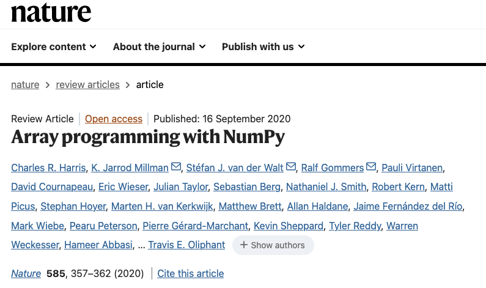
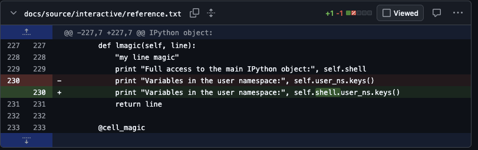

class: title

# Byte-sized RSE: Working with Open Source
## Corran Webster
### Southampton Research Software Group

---
class: title

# Overview

**Introduction:** Working with Open Source

**Practical activity:** Contributing to an Open Source Project

## You should have done setup!

---
class: title reverse

# Working with Open Source
# Introduction

---

# Open Source Software

- is ubiquitous in the modern world
- allows many different people to use and contribute towards improving a codebase
- usually free to use
- works by *licensing* the copyright
- licenses usually restrict *redistribution* in various ways

???

- examples: Linux, Android, Chrome, Firefox, GCC, Python, NumPy, PyTorch
- patents and trademarks can apply to software in addition to copyright
- non-software works can have open licenses, notably Creative Commons licenses
- the author of open source code retains copyright, so code may be licensed in different ways (eg. open and commercial)

---

# Open Source Licenses

- Common restrictions in open source licenses

  - **attribution requirements**
  - **source-sharing requirements**
  - **usage restrictions**

- license may come into effect when *distributing*, *running* or *using* the software.

???

- licenses which only require attribution are often called *permissive*
- licenses which require sharing your source when you distribute, are called *copyleft* or *viral*, and are hard to use in commercial products
- academic research often requires citation of software usage, independent of license requirements

---

# Common Licenses

- *BSD*/*MIT*: simple, attribution-only licenses
- *LGPL*: attribution only for derivative works; changes to LGPL code must be shared
- *GPL*: requires sharing "derivative works" under GPL
- *AGPL*/*SSPL*: requires sharing derivative works when used on a server

???

In order of how restrictive they are.

UK government works are often covered by the Open Government License, which is permissive.

US government works are usually public domain.

---

.left-column[

```
Copyright (c) 2005-2025, NumPy Developers. All rights reserved.

Redistribution and use in source and binary forms, with or without modification, are permitted provided that the following conditions are met:

    * Redistributions of source code must retain the above copyright notice, this list of conditions and the following disclaimer.

    * Redistributions in binary form must reproduce the above copyright notice, this list of conditions and the following disclaimer in the documentation and/or other materials provided with the distribution.

    * Neither the name of the NumPy Developers nor the names of any contributors may be used to endorse or promote products derived from this software without specific prior written permission.
```

]
.right-column[

```
THIS SOFTWARE IS PROVIDED BY THE COPYRIGHT HOLDERS AND CONTRIBUTORS "AS IS" AND ANY EXPRESS OR IMPLIED WARRANTIES, INCLUDING, BUT NOT LIMITED TO, THE IMPLIED WARRANTIES OF MERCHANTABILITY AND FITNESS FOR A PARTICULAR PURPOSE ARE DISCLAIMED. IN NO EVENT SHALL THE COPYRIGHT OWNER OR CONTRIBUTORS BE LIABLE FOR ANY DIRECT, INDIRECT, INCIDENTAL, SPECIAL, EXEMPLARY, OR CONSEQUENTIAL DAMAGES (INCLUDING, BUT NOT LIMITED TO, PROCUREMENT OF SUBSTITUTE GOODS OR SERVICES; LOSS OF USE, DATA, OR PROFITS; OR BUSINESS INTERRUPTION) HOWEVER CAUSED AND ON ANY THEORY OF LIABILITY, WHETHER IN CONTRACT, STRICT LIABILITY, OR TORT (INCLUDING NEGLIGENCE OR OTHERWISE) ARISING IN ANY WAY OUT OF THE USE OF THIS SOFTWARE, EVEN IF ADVISED OF THE POSSIBILITY OF SUCH DAMAGE.
```

]

???

This is the NumPy license.

This is a 3-clause BSD license.

Glibly, this boils down to: give attribution, don't use our names, and don't sue us if the software doesn't work.

---

# Things to Be Aware Of

- Code with no license is still covered by copyright, so *can't be used*.
- Copyleft licences can be problematic when working with industry or when commercialising research.
- On the other hand, copyleft can work well with commercial dual-licensing.
- Research funding may require or prohibit certain types of license.
- If unsure about IP and copyright, talk to senior people in your group.
- If *really* in doubt, talk to a solicitor!

---

# Evaluating Open Source

When thinking about using an open source project, consider:

- is it fit for purpose?
- is the license compatible with use?
- project maturity, code quality, ease of use and documentation?
- is there a community using the code?

---

# Discussion

Your project involves building many robots to be given for free to schools to teach computer science. The robots run linux on a single board computer (for example, a Raspberry Pi).

What are your obligations under the Linux GPL licence?

???

You are distributing Linux in a binary form (likely along with may other GPL programs). You need to include the copyright notice and disclaimer from the GPL code you are using, as well as information about how to get the linux source code. If you haven't modified the source, a link to the third party source you used (likely from the manufacturer of the SBC) is sufficient and should have been provided to you from wherever you got Linux from.

It doesn't matter that your project is non-commercial, but it may matter who *owns* the robots.

Any custom application code that you write for the robots is unaffected by the GPL.

---

# Discussion

You write a mobile application to help with data collection in the field.  The only users are within your research group.  The application uses a BSD licensed library in a critical way.

How do you need to acknowledge the use of the library?

???

You are using the BSD licensed code internally within your organization, so you are not distributing it and so you do not need to include the BSD licence with your application.

However you should cite the library in any relevant papers about your project.

---

# Discussion

You write a Python library which has a dependency on a library licensed under the GPL.  Users will normally install your software using a package manager like `pip` or `conda` to download your library and its dependencies.

What are your obligations under the GPL?

What are your *users'* obligations under the GPL?

???

Because your users are downloading the GPL library using a package manager, you are not distributing the code yourself and so you have no obligations under the GPL.  You may license your code however you like, including a closed-source proprietary licence.

If your *users* distribute software which includes your library and the GPL code (for example in an application) then *they* will likely be bound by the GPL and so their distributed software will be licensed under the GPL.  If your licence is not compatible with the GPL (such as a proprietary closed-source licence) then they may not be able to distribute the software.

---

# Discussion

You are looking for how to implement a particular algorithm and find a GitHub repo with an implementation contained in a much larger library.  The library is MIT licensed.  You copy just the module that implements the algorithm into your code and make your code available via GitHub.

What are your obligations?

???

Because the licences depend on copyright, they become effective whenever usage goes beyond fair use/fair dealing.  Copying a few lines is probably fine, but a module is likely substantial enough that it is protected by the MIT licence terms, and you will have to provide appropriate acknowledgement and include the licence for that module.  You can license your code under any compatible licence.

Note that if the code you copied had been GPL licensed you might have needed to license all your code under a GPL-compatible licence.

---

# Open Sourcing Your Code

.left-column[

- open research code can be very high impact
- requires dedication and perseverance for success
- confer with collaborators before open sourcing code

]
.right-column[



]

- minimum is good, clean code, packaged, with a good README, license, CITATION.cff and DOI.


???

15 years between NumPy release and publication of Nature paper; 25 from Numeric release.

Minimum is good for eg. code supporting a paper. Likely won't become a major thing, but may get used by collaborators and colleagues in your field.

There are journals for open source research software (JOSS is the main one).

---

# Open Source Best Practices

> All code incurs a cost simply by existing.

- code needs to be constantly maintained
- to attract users you need good documentation
- real success requires a community, which means active promotion
- success means more work
- contributor guides and codes of conduct can help
- decide what you want from the software, and give appropriate effort

???

Bugs are discovered, dependencies change, operating systems evolve, new platforms emerge.

There is constant, low-level maintenance needed on code to keep it working and relevant.

High quality code, testing, automation and continuous integration, well-specified dependencies all mean less maintenance and maintenance is easier.

Documentation should include project goals, installation instructions, major dependencies, usage examples, tutorials, and for libraries API documentation (can be auto-generated).

Automate as much as you can with producing documentation, particularly building it.

Host documentation on GitHub, ReadTheDocs, or personal website.

Promotion can be through blog posts, conference talks (particularly at software-oriented venues like SciPy/EuroSciPy and PyData), etc.

Discussion boards/mailing lists can be helpful.

Ongoing work can mean helping with installation, giving guidance, fixing bugs, reviewing PRs, etc.

---

# Contributing to Open Source

- open source is a gift from the developers
- think about *why* you want to contribute
- contributing has lots of secondary benefits:
  - public record of coding ability
  - evidence of research-related activity/community engagement
  - potential source of research collaboration
  - improved software development skills
- follow conventions, be kind and polite

???

Keep in mind when you interact with OSS developers: you are asking for their time and attention *for free*.

Best reasons for contribution are things like: fixing problems or adding features to code *you use*; or where you have specific, applicable knowledge.

Don't contribute to a project just because it is popular or to highlight your own work.

Working on an open source project may currently be one of the best ways to get software development experience as a junior developer.

At some employers, open source participation is a big plus for hiring decisions and evaluation of coding ability. It may even be a reason for head-hunting you.

---

# Example Contribution

.left-column[

- author was working on integrating IPython with a GUI app

]
.right-column[



]

- discovered a bug in the IPython documentation for IPython "magic" commands
- simple fix, took less than 30 minutes
- opened a PR, it was quickly accepted
- fix is *still* in docs after 15 years

---

# AI and Open Source

- copyright status of LLM generated software is currently unclear
- because open source depends on copyright, projects may be wary about LLM generated contributions
- additionally many projects have been swamped by low-effort LLM contributions requiring *human* review and assessment
- many projects have AI policies, respect them
- declare any use of LLMs or other machine assistance
- ultimately *you* are responsible for *any* code you contribute

???

UK law says can machine generated code can be copyrighted.

US Library of Congress says it depends on the amount of human contribution, but single prompt is probably not enough.

EU status is similar to US.

A LLM trained on copyrighted work *may* be a derived work (but *may* be fair use/fair dealing), so *may* be covered by license.

*None of this is yet heavily tested in court!*

AI policies may range from complete embracing, through to complete bans.

You will generally get a better response if you *manually* open PRs and interact with project maintainers yourself.

---

# Handling Rejection

- sometimes even perfectly good PRs are rejected
- in the end it is the maintainer's project, they get final say
- there is nothing stopping you from using *your* fork
- there may be better ways of working with a project

???

A big concern for maintainers is *maintainability*.

It may be better to make an extension or "plug in" for the project.

Eg. you aren't likely to get your research model into PyTorch or SciKit Learn; but following their conventions and using their API and publishing your own package is almost as good from a user perspective.

---
class: title reverse

# Contributing to Open Source
# Practical Activity

---

# Activity Introduction

- We'll contribute a change to an open-source project.
- We'll demonstrate this via live coding.
  - We'll use a repository with example code.

---
class: title reverse

# Thank you!
# What questions do you have?
